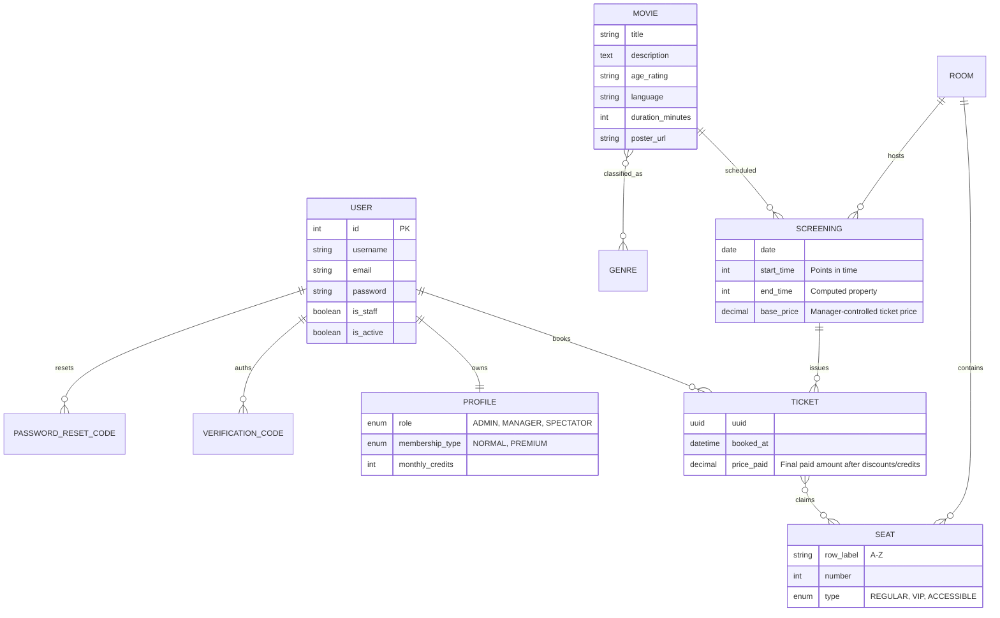

# Detailed System Architecture: Cinema Management Platform

This document provides a deep-dive into the technical implementation, design patterns, and internal workflows of the Cinema Management System.

---

## 1. Project Structural Hierarchy

### 1.1. Backend (Django REST Framework)
- `myproject/`: Project core configuration (`settings.py`, `urls.py`).
- `core/`: Primary business logic.
    - `models.py`: Database schema definitions using Django ORM.
    - `views.py`: API controllers handling requests/responses.
    - `serializers.py`: Data transformation layer between ORM and JSON.
    - `utils.py`: Cross-cutting concerns (PDF generation, QR encoding).
    - `permissions.py`: Custom security roles (e.g., `IsAdminOrReadOnly`).
- `chatbot/`: AI Integration micro-app.
    - `services.py`: Integration with Gemini AI and prompt engineering.

### 1.2. Frontend (React + Vite)
- `src/api.js`: Centralized Axios instance with interceptors for Token Auth.
- `src/components/`: Reusable UI elements (Chatbot, Navbar, Protected Routes).
- `src/pages/`: Page-level components (Movies, Booking, Admin Dashboard).
- `src/App.jsx`: Main router and global layout configuration.

---

## 2. Component Interaction & Data Flow

### 2.1. The AI Assistant Workflow
The AI assistant is not just a wrapper; it's a context-aware system integrated with the database.

1.  **Request**: User sends a message via `Chatbot.jsx`.
2.  **Context Injection**: `chatbot/services.py` fetches all currently showing movies and schedules from the DB.
3.  **Prompt Construction**: 
    - The AI is instructed via a `system_instruction`.
    - It is forced to output JSON in the format: `{"reply": "...", "action": "...", "movie": "..."}`.
4.  **Parsing**: The backend parses the Gemini response.
5.  **Frontend Action**:
    - If `action == "redirect_booking"`, the React app automatically routes the user to the booking page for the specific movie detected.

### 2.2. Automated Ticketing Pipeline
1.  **Creation**: User submits a booking via `Booking.jsx`.
2.  **Validation**: Django validates seat availability and screening overlaps.
3.  **Dynamic Pricing**: `core/views.py` reads `Screening.base_price`, multiplies it by the selected seat count, applies the Premium 20% discount when relevant, and stores the result in `Ticket.price_paid`.
4.  **Simulated Payment**: The React payment form accepts any 16-digit demo card with a future expiry date. The backend `simulate_payment` confirms the 16-digit number for the presentation environment.
5.  **Persistence**: `Ticket` model is saved to the database with the final paid price.
6.  **PDF Generation**: `reportlab` creates a high-definition PDF in a `BytesIO` buffer.
    - Includes a dynamic **QR Code** containing the ticket signature.
7.  **Dispatch**: The PDF is attached to an `EmailMessage` and sent via **TLS-encrypted SMTP** through Gmail.

### 2.3. Manager-Controlled Screening Prices
Managers set `base_price` when creating a screening in the React admin dashboard. The API still returns a read-only `price` alias for backward compatibility, but the source of truth is now `Screening.base_price`.

### 2.4. Identity & RBAC
Authentication responses return `username`, `role`, `membership_type`, and credit information. The navbar displays the active user's username and role, while admin dashboard navigation is shown only to `ADMIN` and `MANAGER` profiles.

---

## 3. Database Schema (Extended ERD)

---

## 4. API Endpoint Reference

| Endpoint | Method | Auth | Description |
| :--- | :--- | :--- | :--- |
| `/login/` | `POST` | Public | Returns Auth Token and User Info. |
| `/movies/` | `GET` | Public | Lists movies. |
| `/genres/` | `GET` | Public | Fetches available movie categories. |
| `/screenings/` | `GET` | Public | Lists active schedules for today and future. |
| `/screenings/` | `POST` | Manager/Admin | Creates a screening with `base_price`. |
| `/tickets/` | `POST` | Token | Books a ticket and triggers PDF/Email. |
| `/tickets/` | `GET` | Token | Fetches the current user's booking history. |
| `/upgrade-membership/` | `POST` | Token | Simulates payment and upgrades the user to Premium. |
| `/users/` | `GET` | Admin | Lists users and roles for administration. |
| `/stats/` | `GET` | Manager/Admin | Returns revenue, ticket, movie, and occupancy metrics. |
| `/chatbot/message/` | `POST` | Public | Interacts with the Gemini AI engine. |

---

## 5. Security Implementation
- **CORS Configuration**: Restricted to specific frontend origins in `settings.py`.
- **Token Interceptors**: Frontend `api.js` automatically attaches the `Authorization: Token <key>` header to every request if the user is logged in.
- **Role-Based Access (RBAC)**:
    - Admin routes (`/admin/*`) are protected by `AdminRoute.jsx` on the frontend and role-aware permissions on the backend.
    - Movies, Genres, Rooms, and Screenings are **ReadOnly** for guests and **ReadWrite** for Admins/Managers.
    - User management endpoints are limited to `ADMIN`; operational statistics are available to `ADMIN` and `MANAGER`.

---

## 6. Development & Deployment
- **Environment Management**: Key secrets (`GEMINI_API_KEY`, `EMAIL_HOST_PASSWORD`) are handled via settings.
- **Fail-Safe Chat**: If the Gemini API is down or quota is reached, the system automatically falls back to a **Mock Responder** mode, ensuring the user is never left without a response.
